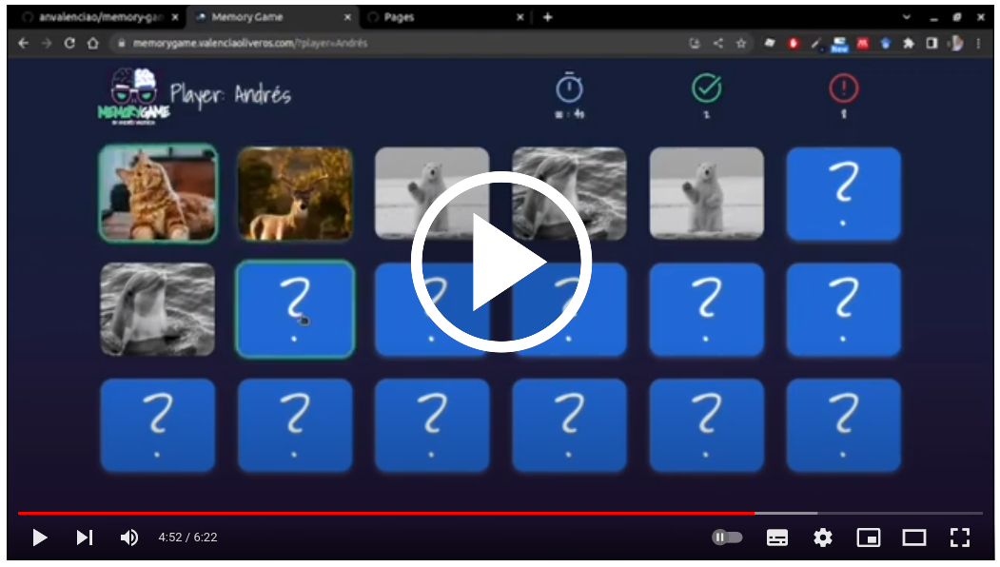

# Memory Match Game

Memory Match Game, also known as  _"Concentration"_, _"Match Match"_, _"Match Up"_, or simply _"Memory"_, is a classic card matching game that challenges players to find all matching pairs of cards in the shortest time possible.

This project is a web-based version of [_Memory Match_](https://en.wikipedia.org/wiki/Concentration_(card_game)), created using HTML, CSS, and JavaScript with the Vue.js framework. It has been developed as part of a coding bootcamp project, and is intended to showcase the developer's skills in front-end web development.

[](https://youtu.be/SWKaKSTpPSA)

## Index

* [1. Game Play](#1-game-play)
* [2. How to Play](#2-how-to-play)
* [3. Instructions](#3-instructions)
* [4. Technical Concepts](#4-technical-concepts)
* [5. Screenshots](#5-screenshots)
* [6. Conclusion](#6-conclusion)
* [7. Credits](#7-credits)

***

## 1. Game Play
The game consists of a grid of cards, each with a hidden symbol on one side. Players can flip two cards at a time, attempting to find matching pairs of symbols. If two cards match, they remain face up; if not, they flip back over. The game ends when all cards have been matched.

Players can keep track of their progress using a timer and a star rating system. The timer starts as soon as the game begins, and the star rating decreases as the player takes more time to complete the game.

## 2. How to Play
To play the game, simply download or clone the repository and open the index.html file in a web browser. However, if you directly open the index.html file using the file:// protocol, you may encounter some issues related to the use of ES modules and the Web App Manifest. To solve this issue, you need to serve the index.html file over the http:// protocol using a local HTTP server.

There are different ways to start a local HTTP server. Here are two ways to do it:

### Node.js
1. Install Node.js on your machine.
2. Open a command line interface in the directory where your HTML file is located.
3. Run the following command:
```
npx http-server
```
4. This will start a local HTTP server that serves your index.html file.

### Python
1. If you have Python installed on your machine, open a command line interface in the directory where your HTML file is located.
2. Run the following command:
```
python3 -m http.server
```
3. This will start a local HTTP server that serves your index.html file.

### Other HTTP server
You can also use any other HTTP server that can serve static files with the correct MIME types.

### Online
Alternatively, you can play the game online at https://memorygame.valenciaoliveros.com.

## 3. Instructions
In this game, the player is required to flip over two cards at a time and try to match them to form pairs. The game starts by requesting the player's name, and then displaying a board with a set of cards facing down. The player must flip two cards per turn and try to find all matching pairs.

If the cards match, the player earns one point, and the cards remain face up. If they do not match, the player earns one error point, and the cards return to their original position. The game ends once the player successfully matches all cards, and a congratulatory message is displayed along with the player's name.

## 4. Technical Concepts
This project was developed using Vue.js 3 framework and utilizes Bootstrap 5 for styling. It uses asynchronous requests to retrieve animal images from a provided API endpoint and have a simple and clean design, making it easy for users to focus on the game.

### Separation of Concerns
Separation of Concerns is a principle that aims to keep the structure (markup), presentation (style), and behavior (scripts) of a web page strictly separated. This promotes maintainability and reusability of the code. To achieve this, the Vue.js framework was chosen, which  allows the division of responsibilities into templates, scripts, and styles, each in its own separate file. This approach provides benefits such as syntax highlighting, CSS support, and the ability to easily use preprocessors like Jade or SCSS. More information about the Separation of Concerns principle can be found in the Google HTML/CSS Style Guide (https://google.github.io/styleguide/htmlcssguide.html#Separation_of_Concerns).

### Board Marking Structure
In order to create the game board, the functionality of the cards was compared to that of the input type checkbox element. The checkbox allows for single values to be selected or deselected, and can also be disabled. To replace the checkbox with images and make them interactive, the label element was utilized. When a user clicks or touches a label, the browser directs focus to its associated input element, triggering an event. To associate a label with an input element, you must first add the id attribute to the input element, then add the for attribute to the label element, with the same value as the input element's id. This structure was chosen to achieve a clean and user-friendly interface for the game. Additionally, it enables navigation functionality, using the Tab and Shift+Tab keys to select cards and navigate through them.


### localStorage
The localStorage property was used to store the current state of the game, including cards with correct matches, elapsed time, and number of correct and incorrect guesses. This allows the user to refresh the screen, close the tab, reopen it and continue the game where they left off, all automatically.

## 5. Screenshots      
The game features three screens:

1. The first screen is displayed when a new game is started and prompts the user to enter their nickname.

2. The second screen is the game board which displays the clock, the number of correct matches, and the number of errors.


3. The final screen is a congratulatory message that displays the user's name when they successfully match all the cards.


Google Lighthouse


## 6. Conclusion
This Memory Match game project is a fun and interactive way to test your memory and concentration skills. It is an excellent example of using Vue.js to create a functional and visually appealing web-based application.

## 7. Credits
The Memory Match game was developed by Andrés Valencia as part of a coding bootcamp project. It is based on the classic Memory Match game and was inspired by similar web-based versions of the game.

The game logo is a modified version of Freepik's "Plantilla de logotipo nerd dibujado a mano" vector file, which is available at the following URL: https://www.freepik.es/vector-gratis/plantilla-logotipo-nerd-dibujado-mano_21077478.htm

The icons are modifications of Google Fonts Material Symbols, which are available at the following URL: https://fonts.google.com/icons

The _Shadows Into Light_ font was designed by [Kimberly Geswein](https://fonts.google.com/?query=Kimberly+Geswein) and is available on Google Fonts. You can access it by clicking the following URL: https://fonts.google.com/specimen/Shadows+Into+Light?query=Shadows.